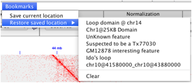
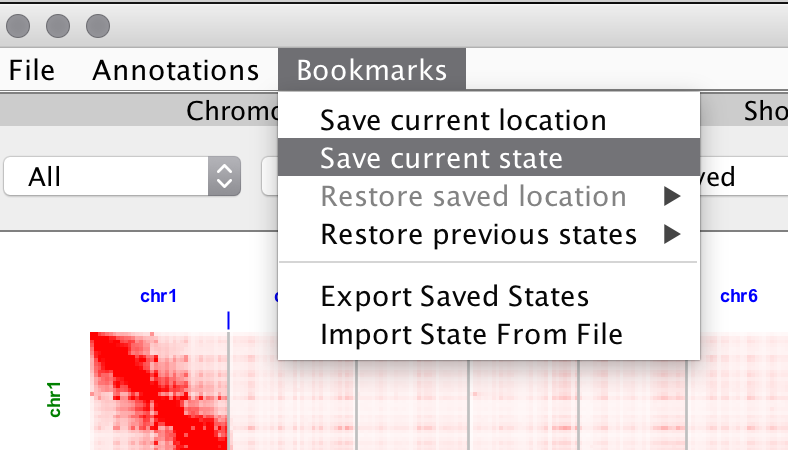
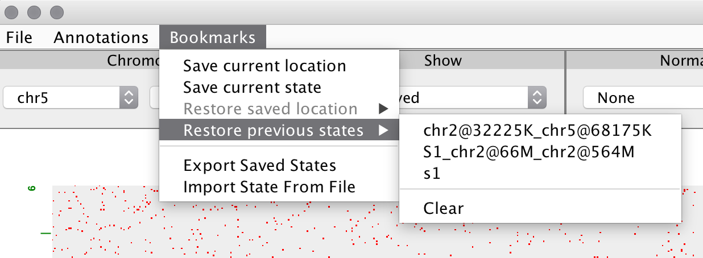
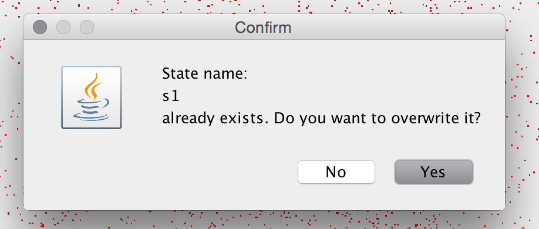
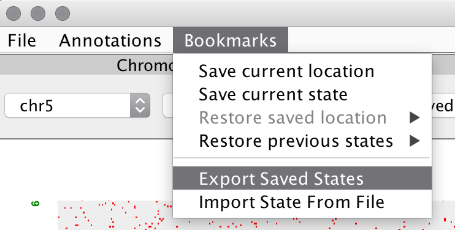

# Bookmarks #
##Loading Location##
You can use the Bookmarks menu to save and restore location and resolution data. Select *Bookmarks* and choose *Save current location*. A pop up window will appear and ask for a name to associate with the position. Enter a description for the new bookmark. Choosing *Restore saved location* will then navigate immediately to the location and resolution in the current map. The location can also be opened in another map. Saved location are kept in registry and can be used after restarting Juicebox.

##Save State##

Under the Bookmarks menu, there is an option to Save current state which allows you to save your current workspace, or state, in Juicebox. A *state* includes the loaded HiC map, matrix type, location, normalization, loaded tracks, etc.

You have the option to reload these states by going to the Restore previous states option under the Bookmarks tab, which will be filled with a list of your saved states.

Upon clicking the Save current state option, you will be prompted to select a name for your current state. If a state with that name already exists, you have the option to rename it or to overwrite it.

Under the Bookmarks tab, there are options Export Saved States and Import States From File which allow you to share your “saved states” with other Juicebox users.

When exporting a file, you can choose what to name your file and where to save it. You can share your states with others through E-mail, Dropbox, etc.

In order to import a file of saved states that someone has shared with you, click on Import States From File. When you go under the Restore previous states menu, it will be filled with a list of the valid states that the person has shared with you. If you import a file of states, but you already have states saved in your Juicebox, they will be exported to a file called *OriginalSavedStates.xml* 
