# Navigating the map #

## Chromosome drop down menu ##

In order to show different location on the map, use the chromosome selector on the top right size of the menu bar.

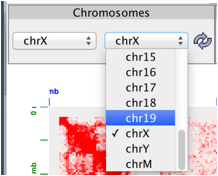

Select both chromosomes for x and y axis, and click on the purple refresh arrows to load.

## Mini-Map ##

You can also navigate the map by clicking on the birds-view map on the right side of the screen.

## Choose Zoom Area ##

You can use <code>alt</code> key + <code>click</code> and drag on the main map to draw a rectangle. Release the mouse to complete your selection. The map will zoom into the selected area.

## Resolution slider ##

Use the resolution selector to choose zoom level. To switch between base-pair delimited resolutions and fragment-delimited resolutions, click on the blue `Resolution` label.

Alternatively, double-click on any area in the main map to zoom in.

## Goto Box ##

Use the `Goto Box` in the upper left corner, and choose a position for the X and Y axis. The format is:

```
chr:x1-x2:[BP Resolution]
chr1:39500001-39750000:250000
```

The Resolution is optional. You can also right-click in the heat map and select copy position
to clipboard. This will save the current position in the `Goto Box`. You can also search for a human or mouse gene using its official symbol (e.g. `HOXC9`).

## Superzoom ##

You can enlarge a region while locking the resolution by using the lock button in the resolution menu. Do this by pressing the lock button, and then selecting a region using the <code>alt</code> key while dragging the mouse. The map will zoom in on the selected region, but will not change the resolution.

# Compare maps and annotations #

## Control Map ##

After opening a Hi-C map, load a second Hi-C map as a control to compare features in the two maps. From the `File` menu, click `Open control...` and select a second map from the list. The title of Juicebox will now show both the names of map and the control loaded. Using the `Show` combo box, select `Observed` to show the main map. Using the `Show` combo box, select `Control` to show the control map. Pressing `F1` (or `fn F1`) will switch between Observed and Control mode.

Using the `Show` combo box, select `VS` to view the maps side-by-side (GM12878 vs IMR90 - ADAMTS1 gene) with the observed map below the diagonal and the control map above the diagonal:


You can also view Observed/Expected for both maps side-by-side using `Observed/Expected (Observed vs Control)`

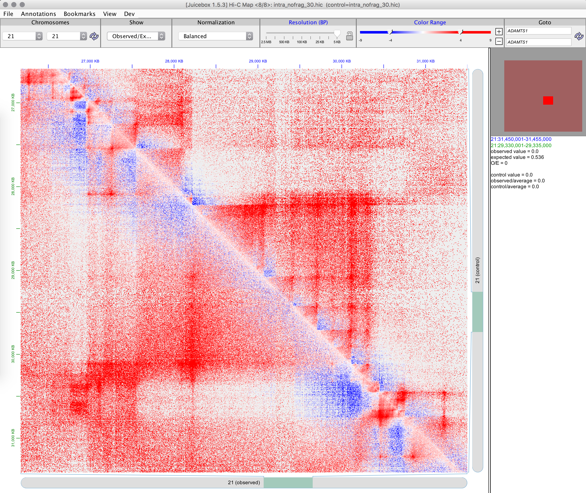

Select `Observed/Control` to show relative enrichment between the maps.

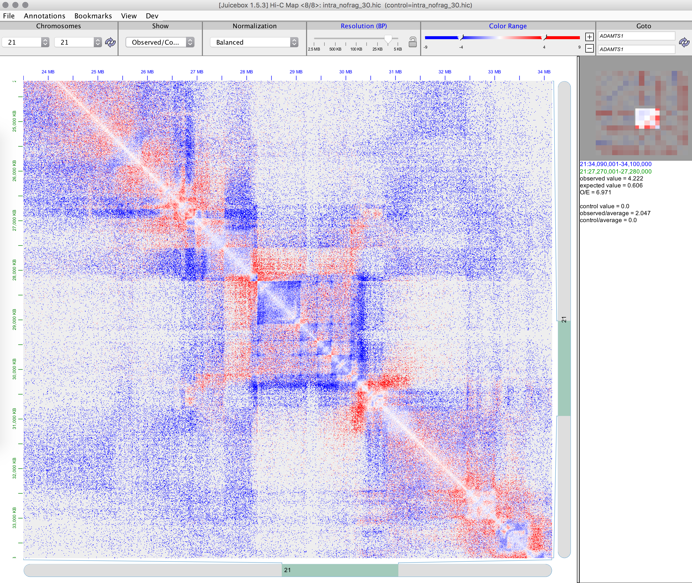

You can also view `Observed - Control`.

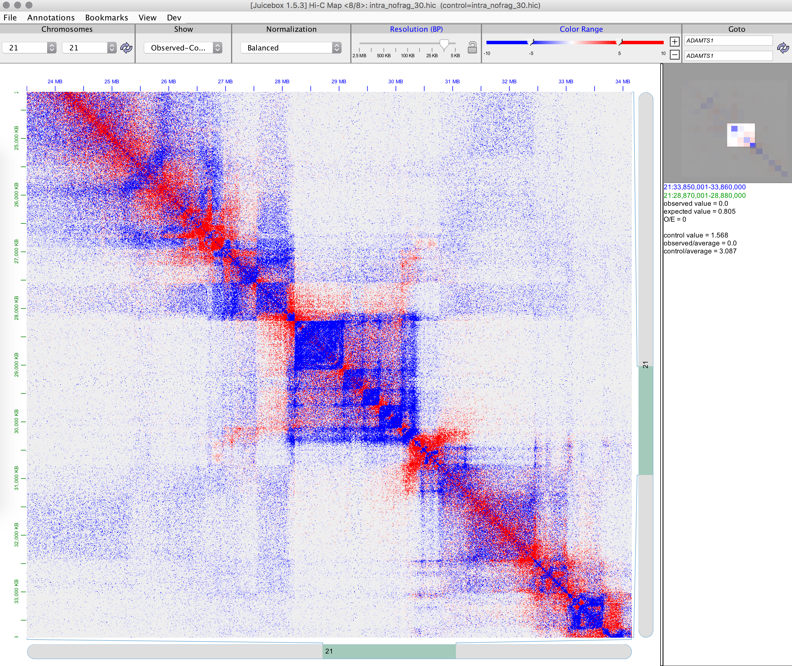

It is also possible to view `Pearson (Observed vs Control)` side-by-side for both maps, but only at available resolutions (here with GM12878 Paternal vs Maternal)

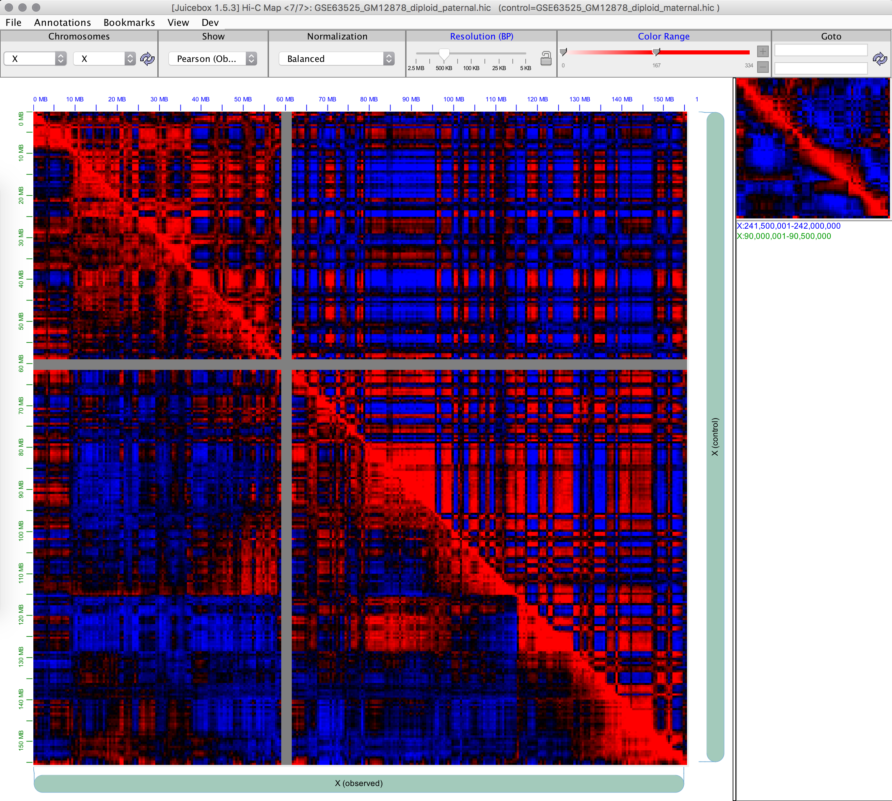

# Multiple Maps #

You can open multiple Juicebox windows simultaneously to compare regions. Juicebox also supports location and resolution syncronization between the open windows.  Go to File -> New Window to open a second Juicebox window.

## Continuous Sync ##

Open a second session of Juicebox, and open a map. Arrange the maps side by side and choose a position on one of the maps. Right click the main map, and select `Continuous Sync`. The two Juicebox sessions will show the same position. The second map will track the location in the first map until the `Continuous Sync` option is toggled off.

## Single Sync ##

If you are only interested in a single synchronization between the two maps, right-click the map and select `Single Sync`. This will cause the second Juicebox session to reposition to the location of the first, but will not continuously sync with the first session.

# Other functions #
## Straight edge ##
Use the straight edge to highlight current mouse positions on the map and annotations. Right click on the main map, and select `Straight Edge` to toggle the feature on and off.


## Freeze hover text, copy ##
While the mouse hovers over the heat map, information about the position and map features appears in the information pane on the right side. In order to freeze that pane and copy the information, right click and toggle the `Freeze Hover Text` option.		

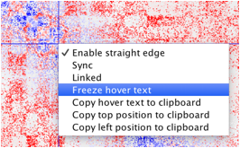

Use the mouse to select the text in the information pane, and copy the data to the clipboard.

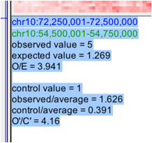

# Change Data Views #

## O/E, Pearson, Expected ##

From the menu bar, select the `Show` combo box. Besides the default `Observed` view, you can also display additional options. 

The `Expected` view shows the expected reference map - increasing distance between loci decreases contact frequency.

The `Observed/Expected` view shows contacts as a ratio of the observed value map to the expected reference map.

The `Pearson` view shows patterns of correlation between loci.

## Color slider ##

Use the left and right handles of the color slider to set the minimum and maximum values for the map color range respectively. Use the <code>+</code>/<code>-</code> buttons to increase or decrease the overall slider range.

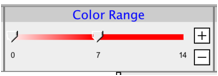

You can also click the `Color Range` label to set the minimum and maximum values using a dialog box.

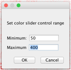

Setting the values will adjust the color saturation of the heat map with in-between color values linearly interpolated. As an example, this would recalibrate the color range values:

before:	

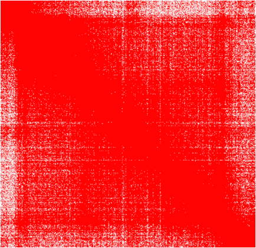

after

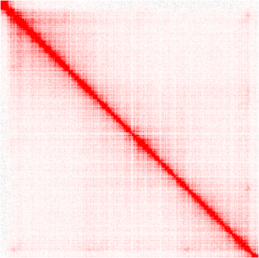

## Normalizations ##

The normalization tool gives you the option to choose between different normalization algorithms used to remove biases from the Hi-C matrix. Depending on the map viewed, different normalization options are presented. We recommend using <i>Balanced</i> - the Knight-Ruiz balancing algorithm.

<center>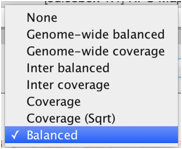</center>

For more information about KR normalization, read the supplemental materials of the <a href="http://www.cell.com/cell/abstract/S0092-8674(14)01497-4">2014 Cell paper</a>.