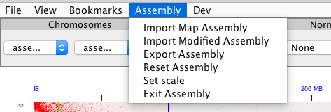
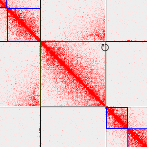
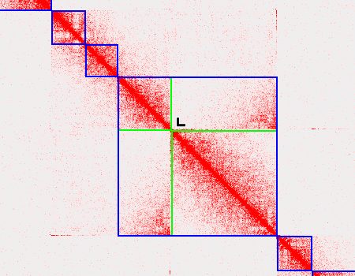
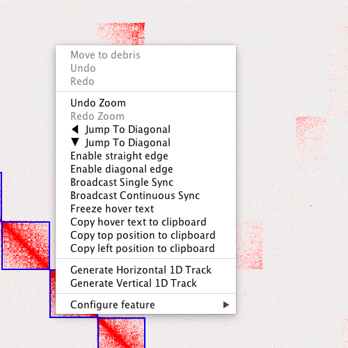

# Genome Assembly Cookbook

Read about Juicebox Assembly Tools in <a href="https://www.dropbox.com/s/yq5oeuh0c9dlzhw/manual_180322.pdf?dl=0">Genome Assembly Cookbook</a>.

# Assembly Menu Options

 

## Loading and Saving Assemblies
Prerequisites: Load Maps, Generate .hic and .assembly file from 3D-DNA Pipeline, Juicebox version 1.8.8

To load assemblies in Juicebox first load a .hic file then select "Import Map Assembly". Select an assembly file corresponding to the map loaded (.assembly).

To save the assembly changes made click "Export Assembly". This will create a .assembly file that can be used with a script to implement the changes in the original fasta file and can also be used to save the session.

## Loading Previous Work

Load Original Map and .assembly file. Click on "Import Modified Assembly" and select previously saved work

## Other

"Reset Assembly" will reset the assembly to its original state.
"Set scale" is used for changing the scaling of the Hi-C map.
"Exit Assembly" will exit the assembly mode in Juicebox.

# Assembly Changes

## Selecting genomic interval

To select a single scaffold shift click on a scaffold. Shift click and drag to select an interval of more than one scaffold. Adjust the selection by clicking and dragging across the scaffolds of interest.

## Move selection

Select one or more scaffolds then point and click mouse cursor near diagonal at intersection between scaffolds.

## Invert selection

 

Select one or more scaffolds. Move cursor to upper right/lower left corner of selection box and click when the prompt cursor appears.

## Adjusting boundaries of superscaffolds

 

Select in between scaffolds at the diagonal to adjust the boundary of a superscaffold.

## Correcting a misjoin
Select a single scaffold and move the mouse cursor close to the diagonal. A cursor with a yellow box will appear. Resize the box using scroll. Then, click to split the scaffold into three smaller scaffolds. A short scaffold is formed inside the yellow box which is relocated to the end of the refrence genome assembly. The other two scaffolds stay in place and can be moved independently.

## Right Click Menu

Changes can be reversed or redone by selecting undo or redo or using the keyboard shortcut:
undo 'cmd+u' or 'ctrl+u' 
redo 'cmd+r' or  'ctrl+r'

Jump to diagonal moves the view to the diagonal in the direction of the arrow.

