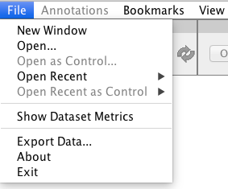
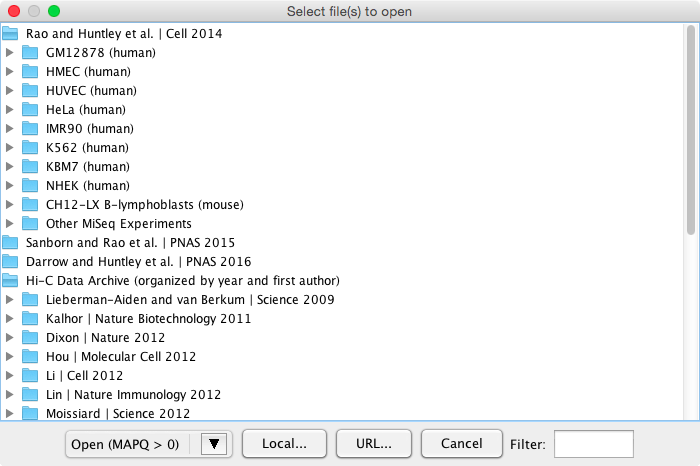
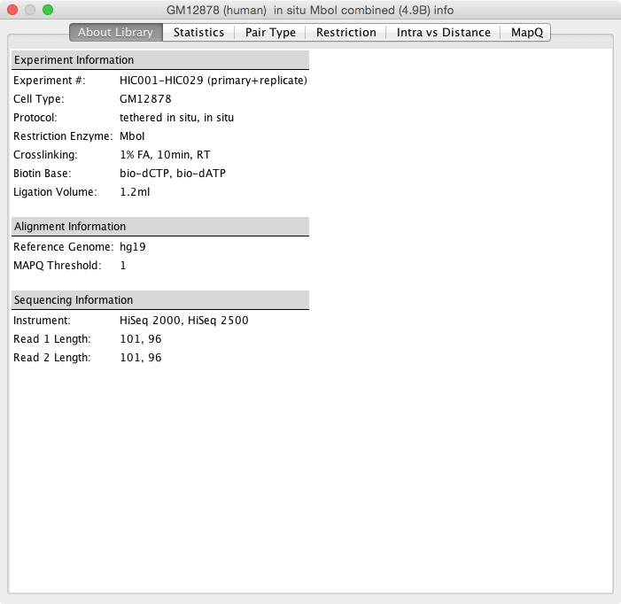
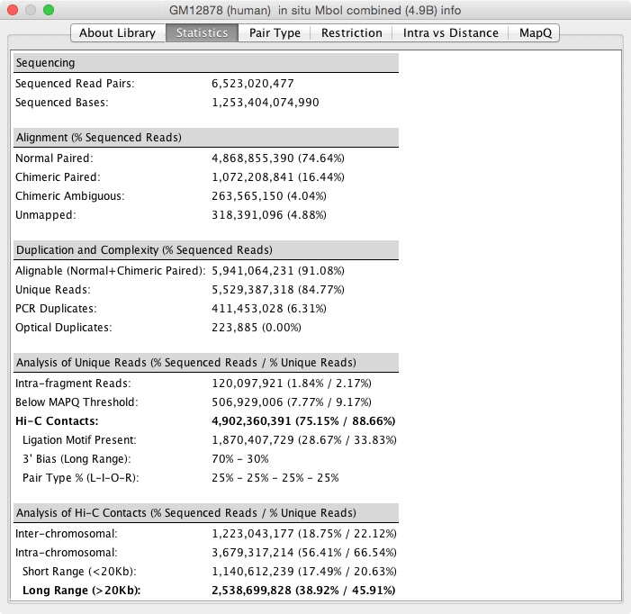
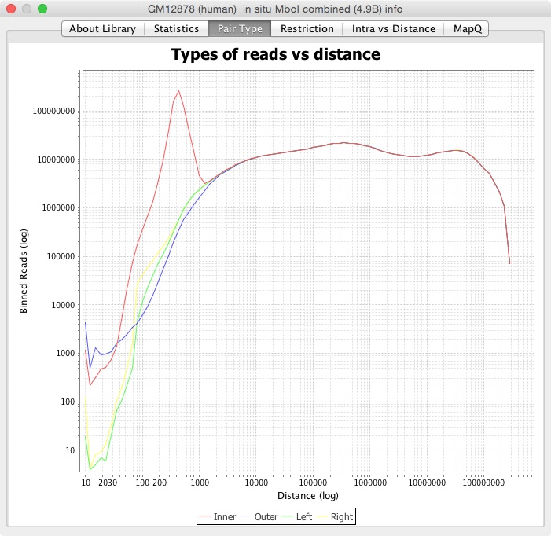
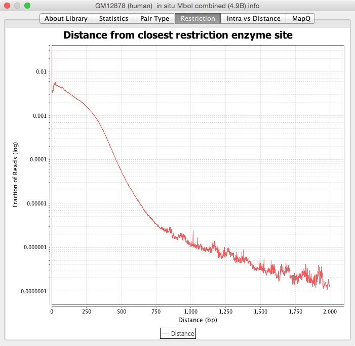
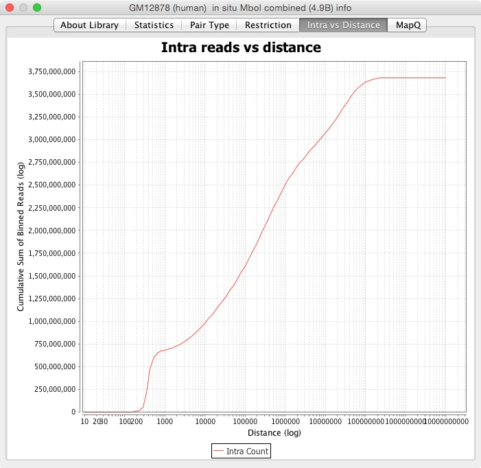
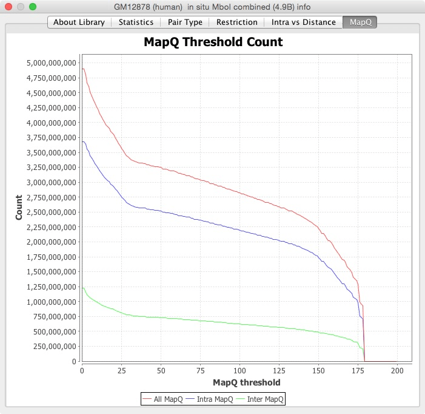

# Open #
From the *File* menu, clicking *Open* or *Open Control* will bring up a list of all of the Hi-C maps from our publications, including <a href="http://www.cell.com/cell/abstract/S0092-8674(14)01497-4">our Cell paper</a>, as well as extant datasets from other labs (the Hi-C Data Archive).

<br>

																Click on the folders to find maps within that cell type.  Double-clicking on the name of a map will load it.  Alternatively, you can either click the button *Open MAPQ &gt; 0*, or select the arrow next to the button and you'll see the option to *Open MAPQ &gt; 30*.

You can select multiple maps to load by holding down the Ctrl key or Apple key, or by holding down the Shift key and selecting a series.  The maps will be summed together when loaded.

You can load a local file that lives on your hard drive using the *Local* button, or load from URL using the *URL* button.

Load a control map after opening a map if you wish to see one map divided by another; more on this in the [Exploring the Data](https://github.com/theaidenlab/juicebox/wiki/Juicebox-Tutorial#exploring-the-data) section.

# Filtering by name #

When choosing to load a HiC file under the Open File menu, you will notice a text box in the bottom right corner of the Open window. This is a case-sensitive search filter that allows you to search for HIC files by name or number. If a file contains the string that you search, a file path will be opened and the matching text will be highlighted in red. You are also able to search for multiple files by separating your searches with commas. If there is a match for the other files that you search for, the text will be highlighted in other colors.


# Recent maps #

The *Open Recent* menu will be populated with the maps you've opened most recently.

# Dataset metrics #
Once you've loaded a map, *Show Dataset Metrics* displays statistics about the map.  The *About Library* tab contains information about how the experiment was conducted.  The *Statistics* tab contains quality control statistics you can use to judge the quality of the library (see the Supplemental Materials of <a href="http://www.cell.com/cell/abstract/S0092-8674(14)01497-4">our Cell paper</a> for more).

   The next tabs are different graphs with other ways to visualize the statistics.  The *Pair Type* graph has each pair type versus how far apart they are.  The *Restriction* tab contains the distance from the closest restriction enzyme site.  The *Intra vs Distance* is a cumulative sum of the reads versus the distance between them.  The *MapQ* tab is a histogram of the reads at different MapQ thresholds. 

																 
 


# Export data #

Export data from the map by selecting *Export Data*.  You can choose what to export and where to save it.  For big, dense matrices, this could take a long time.

# Changing the menu #
You can create your own menu by creating a properties file and typing `F10` to load it.  The default properties file is http://hicfiles.tc4ga.com/juicebox.properties  

Here are some lines from the properties file:
```
1Cell_2014 = root, Rao and Huntley et al. | Cell 2014
GM12878 = 1Cell_2014, GM12878 (human)
GM12878_1in_situ = GM12878, in situ MboI

#Under GM12878 in-situ MboI menu
GM12878_1in_situ_1combined = GM12878_1in_situ, primary+replicate (4.9B), https://hicfiles.s3.amazonaws.com/hiseq/gm12878/in-situ/combined.hic
GM12878_1in_situ_2primary = GM12878_1in_situ, primary (2.6B), https://hicfiles.s3.amazonaws.com/hiseq/gm12878/in-situ/primary.hic
GM12878_1in_situ_3replicate = GM12878_1in_situ, replicate (2.3B), https://hicfiles.s3.amazonaws.com/hiseq/gm12878/in-situ/replicate.hic
```
The keys will be sorted before they are added, so you may need to have numbers in the titles to preserve ordering. 

There are two types of properties: folders and items.  A folder is described by:
```
key = parent_key, text_to_be_displayed
```
The parent_key must appear in earlier sorted order in the file before the current key.

The item is the actual .hic map.  
```
key = parent_key, text_to_be_displayed, URL_or_file_location
```
For MAPQ > 30 maps, Juicebox searches for the same filename but with `_30.hic` as the extension; so for the primary+replicate example above, Juicebox searches for `https://hicfiles.s3.amazonaws.com/hiseq/gm12878/in-situ/combined_30.hic` when MAPQ > 30 is selected.

Let's try [loading annotations](https://github.com/aidenlab/Juicebox/wiki/Loading-Annotations-(Annotations-menu)) next.
