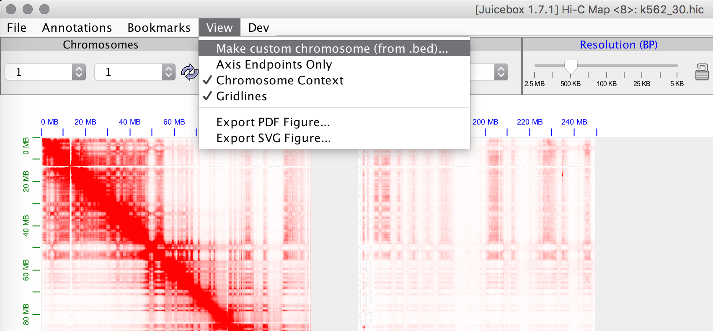
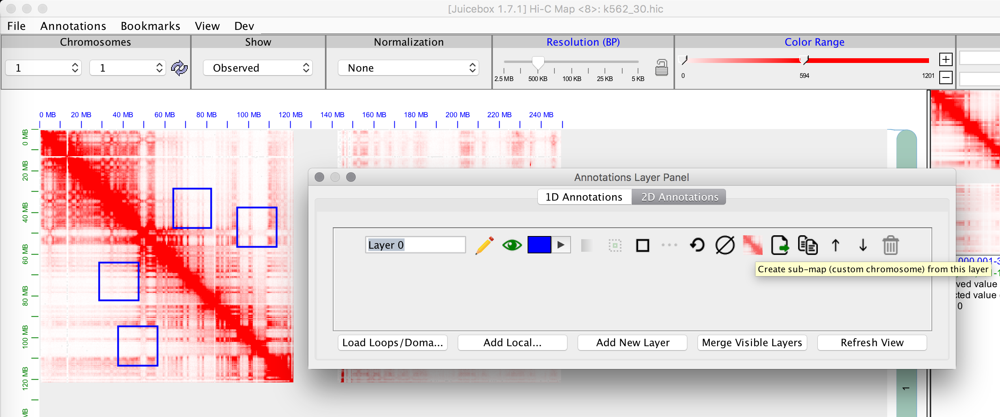
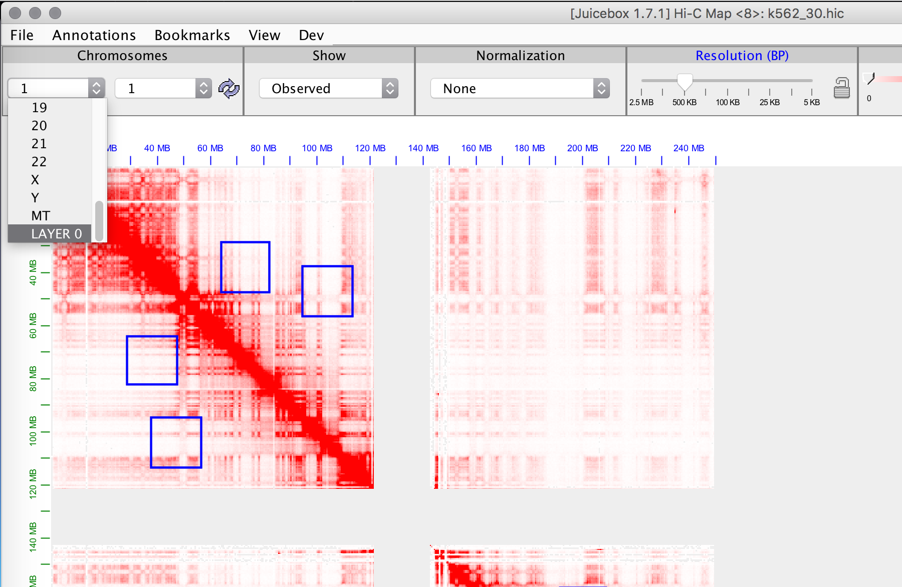
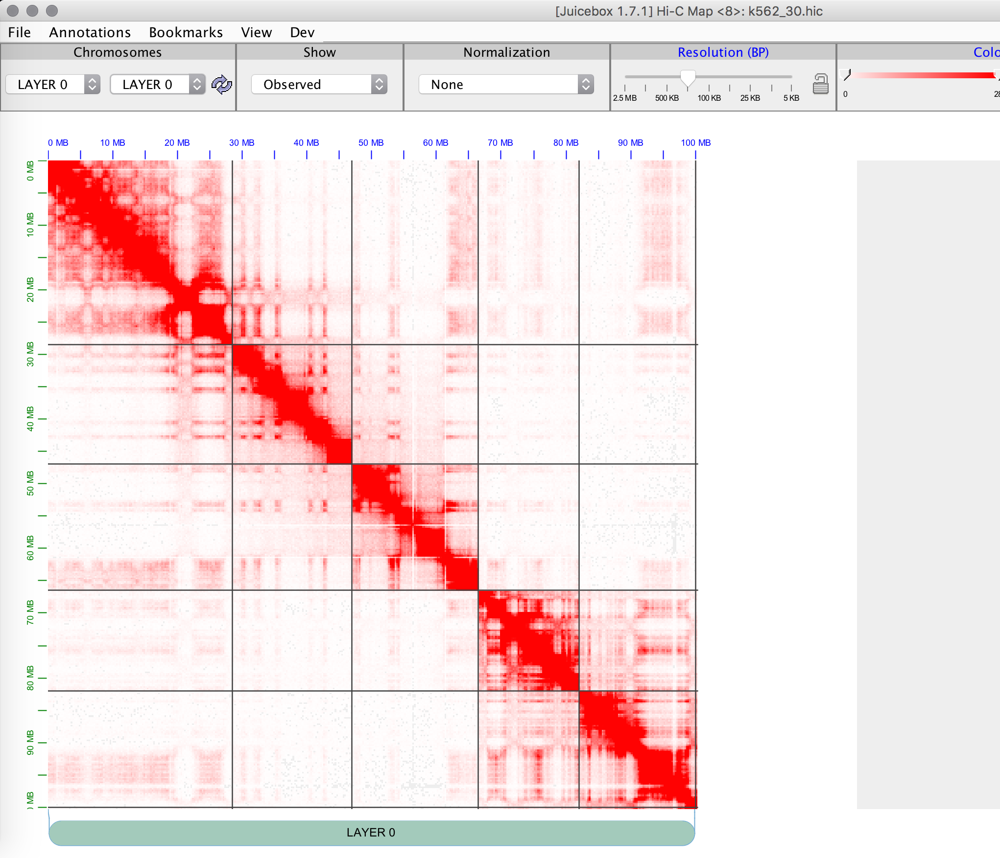
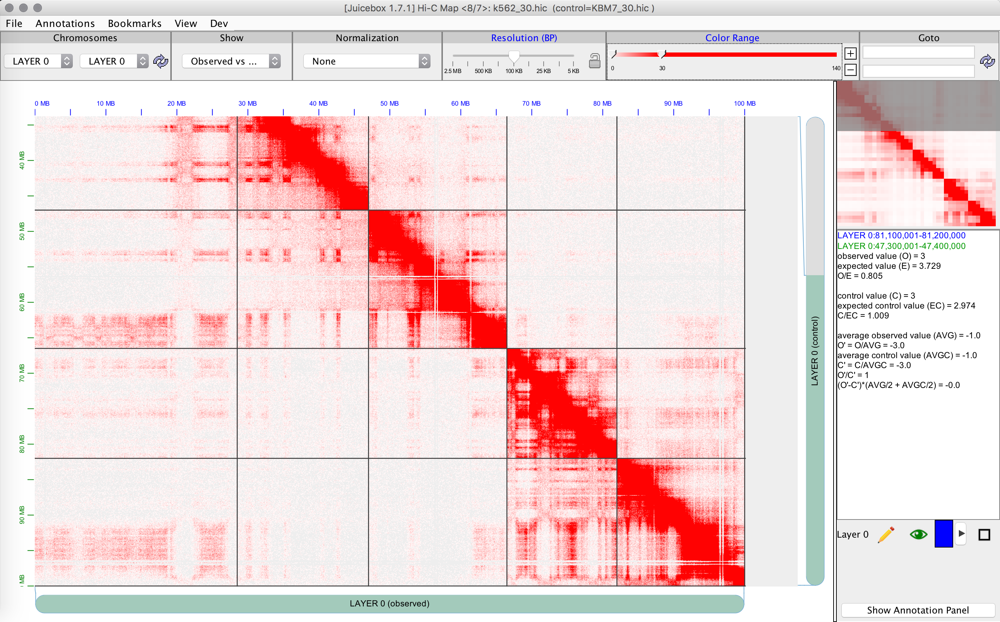
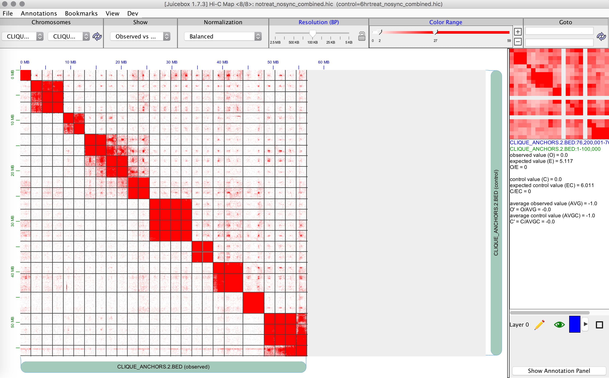

Submapping is memory intensive and makes several calls to the hic file, so it is recommended to only use this with local/downloaded files. The idea is to create a map with just the regions you are interested in (including different chromosomes; e.g. degron superenhancer clique). All the critical features should be working in this mode (zooming, VS mode, normalization, color scale, most 1D tracks, etc.), but if you encounter any bugs, please let us know. There are a few things missing (e.g. observed / expected is not yet available in this mode; observed over control is available though).

You can specify regions with either a bed file or with 2D annotations:

This will then create a new chromosome in the dropdown:

And it'll populate just the selected regions (with zooming/normalization preserved):

Here's an example of K562 vs KBM7 (lower right corner for differences):

Here's the degron superenhancer clique using the following bed file:

	chr1	8100000	8200000
	chr2	182600000	182850000
	chr2	224400000	224500000
	chr2	227000000	227100000
	chr3	111575000	111675000
	chr3	156500000	156600000
	chr4	11500000	11700000
	chr4	30750000	30850000
	chr4	75500000	75600000
	chr4	102000000	102100000
	chr4	169425000	169525000
	chr4	187700000	187900000
	chr6	129937500	130037500
	chr6	145187500	145287500
	chr6	151325000	151425000
	chr6	159225000	159325000
	chr7	116075000	116175000
	chr7	130525000	130625000
	chr8	94800000	95000000
	chr8	126600000	126725000
	chr8	128200000	128300000
	chr10	112112500	112212500
	chr10	114200000	114300000
	chr12	66000000	66100000
	chr12	76000000	76100000
	chr12	89275000	89375000
	chr12	116900000	117000000

Gridlines can be toggled from the view menu.
