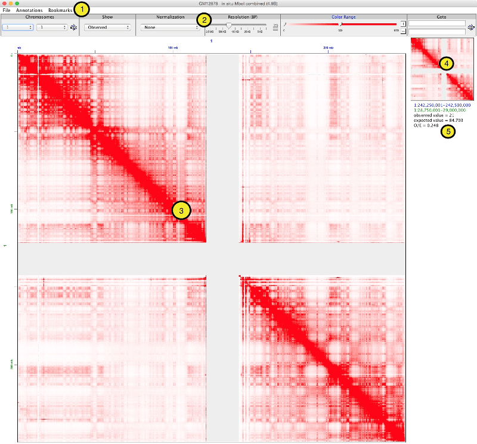

# Getting Oriented #

1. **Main menu**.  From the *File* menu, you can open maps, load control maps, see dataset metrics, and export an image. From the *Annotations* menu, you can load one dimensional and two dimensional features and see them alongside the Hi-C map. From the *Bookmarks* menu, you can save your location to load it again later.														

2. **Toolbar**.  Select chromosomes, switch between Observed, Observed/Expected, Control, and other views, adjust normalization, change the resolution, fine-tune the color range, or go to a specific location in the map.

3. **Heat map**.  This is where the heat maps load.  You can pan by grabbing the map with the mouse and moving; double-clicking zooms in.  You can also zoom in by holding down ALT key and drawing a box around a region of interest.									

4. **Mini Map**.  You can see where you are within a chromosome at any time from the mini map. You can move the transparent square in the mini map to quickly change the main map.													

5. **Information pane**.  When the mouse moves over the heat map, the text in the pane is updated with information about the specific Hi-C pixel.  When features are loaded on the map, detailed information about them appears here.

Let's see how to [load a map](Loading-Maps-(the-File-menu)) next.
