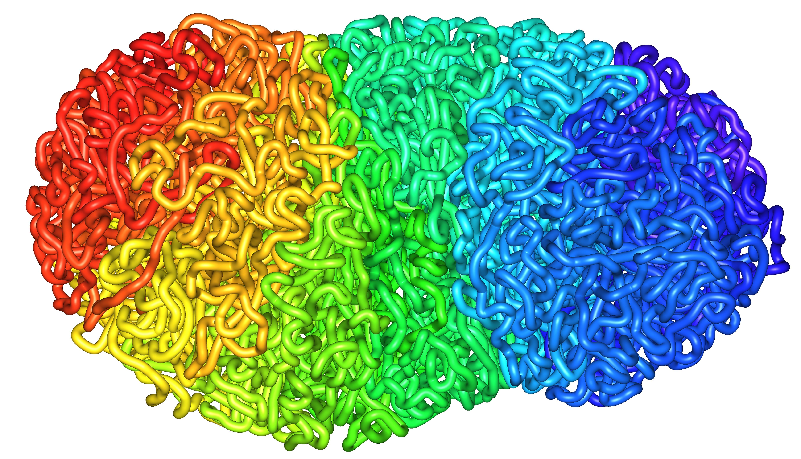

<h1 id="cover-heading">
  Aidenlab Documentation Website  <!-- TODO: Update title -->
</h1>

>  One stop shop for all Aidenlab documentation <!-- TODO: Replace with your description -->

<!-- TODO: Update to match your project's benefits/features. Git emojis work great here. -->

- :hourglass_flowing_sand: Learn how to use Juicebox, Juicer, Juicertools and straw.
- :open_file_folder: Seamlessly copy code to drive your own genome exploration projects

<!-- TODO: Set your background color or image. -->

